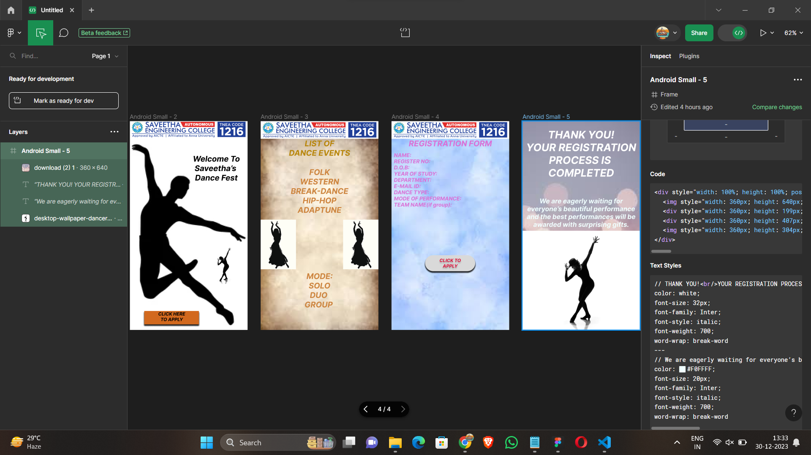

# Ex09 Event Registration Web Application
## Date: 30/12/2023

## AIM:
To design, develop and deploy a web application for event registration.

## DESIGN STEPS:

### Step 1:
Create a new frame.

### Step 2:
Select any one preset size of your choice.

### Step 3:
Select the shapes you need.

### Step 4:
Import images as needed.

### Step 5:
Create pages based on your need and link them.

### Step 6:

Validate the HTML and CSS code.

### Step 6:

Publish the website in the given URL.

## DESIGN TOOL:
Figma
## CODE:
 ```
 main page 
 <div style="width: 100%; height: 100%; position: relative; background: white">
    
    
    <div style="width: 191px; height: 160px; left: 169px; top: 101px; position: absolute; text-align: center; color: black; font-size: 24px; font-family: Inter; font-style: italic; font-weight: 700; word-wrap: break-word">Welcome To Saveetha’s 
  Dance Fest</div>
    <div style="width: 167px; height: 41px; left: 44px; top: 582px; position: absolute; background: #D2691E; box-shadow: 0px 4px 4px rgba(0, 0, 0, 0.25)"></div>
    <div style="width: 168px; height: 41px; left: 44px; top: 582px; position: absolute; text-align: center; color: black; font-size: 14px; font-family: Inter; font-style: italic; font-weight: 700; word-wrap: break-word">CLICK HERE
  TO APPLY</div>
    
</div>

// Welcome To Saveetha’s 
Dance Fest
color: black;
 font-size: 24px;
 font-family: Inter;
 font-style: italic;
 font-weight: 700;
 word-wrap: break-word
---
// CLICK HERE
TO APPLY
color: black;
 font-size: 14px;
 font-family: Inter;
 font-style: italic;
 font-weight: 700;
 word-wrap: break-word

 list page 

 <div style="width: 100%; height: 100%; position: relative; background: white">
    
    
    
    <div style="width: 360px; height: 586px; left: 0px; top: 54px; position: absolute; text-align: center; color: #B8860B; font-size: 24px; font-family: Inter; font-style: italic; font-weight: 700; word-wrap: break-word">LIST OF
  DANCE EVENTS</div>
    <div style="width: 360px; height: 498px; left: 0px; top: 142px; position: absolute; text-align: center; color: #CD853F; font-size: 24px; font-family: Inter; font-style: italic; font-weight: 700; word-wrap: break-word">FOLK
  WESTERN
  BREAK-DANCE
  HIP-HOP<br/>ADAPTUNE<br/><br/><br/><br/><br/><br/><br/>MODE:<br/>SOLO<br/>DUO <br/>GROUP <br/><br/><br/><br/></div>
    
</div>

// LIST OF
DANCE EVENTS
color: #B8860B;
 font-size: 24px;
 font-family: Inter;
 font-style: italic;
 font-weight: 700;
 word-wrap: break-word
---
// FOLK
WESTERN
BREAK-DANCE
HIP-HOP<br/>ADAPTUNE<br/><br/><br/><br/><br/><br/><br/>MODE:<br/>SOLO<br/>DUO <br/>GROUP <br/><br/><br/><br/>
color: #CD853F;
 font-size: 24px;
 font-family: Inter;
 font-style: italic;
 font-weight: 700;
 word-wrap: break-word

 registation form

 <div style="width: 100%; height: 100%; position: relative; background: white">
    
    
    <div style="width: 360px; height: 23px; left: 0px; top: 54px; position: absolute; text-align: center; color: #DA70D6; font-size: 24px; font-family: Inter; font-style: italic; font-weight: 700; word-wrap: break-word">REGISTRATION FORM</div>
    <div style="width: 360px; height: 182px; left: 0px; top: 95px; position: absolute; color: #DA70D6; font-size: 16px; font-family: Inter; font-style: italic; font-weight: 700; word-wrap: break-word">  NAME:<br/>  REGISTER NO:
    D.O.B:<br/>  YEAR OF STUDY:<br/>  DEPARTMENT:<br/>  E-MAIL ID:<br/>  DANCE TYPE:<br/>  MODE OF PERFORMANCE:<br/>  TEAM NAME(if group):</div>
    <div style="width: 153px; height: 49px; left: 103px; top: 411px; position: absolute; background: #D9D9D9; box-shadow: 0px 4px 4px rgba(0, 0, 0, 0.25); border-radius: 42px"></div>
    <div style="width: 153px; height: 49px; left: 103px; top: 411px; position: absolute; text-align: center; color: #DC143C; font-size: 14px; font-family: Inter; font-style: italic; font-weight: 700; word-wrap: break-word">CLICK TO
  APPLY</div>
</div>

// REGISTRATION FORM
color: #DA70D6;
 font-size: 24px;
 font-family: Inter;
 font-style: italic;
 font-weight: 700;
 word-wrap: break-word
---
//   NAME:<br/>  REGISTER NO:
  D.O.B:<br/>  YEAR OF STUDY:<br/>  DEPARTMENT:<br/>  E-MAIL ID:<br/>  DANCE TYPE:<br/>  MODE OF PERFORMANCE:<br/>  TEAM NAME(if group):
color: #DA70D6;
 font-size: 16px;
 font-family: Inter;
 font-style: italic;
 font-weight: 700;
 word-wrap: break-word
---
// CLICK TO
APPLY
color: #DC143C;
 font-size: 14px;
 font-family: Inter;
 font-style: italic;
 font-weight: 700;
 word-wrap: break-word

 last page 

 <div style="width: 100%; height: 100%; position: relative; background: white">
    
    <div style="width: 360px; height: 199px; left: 0px; top: 0px; position: absolute; text-align: center; color: white; font-size: 32px; font-family: Inter; font-style: italic; font-weight: 700; word-wrap: break-word">THANK YOU!<br/>YOUR REGISTRATION
  PROCESS IS 
  COMPLETED</div>
    <div style="width: 360px; height: 407px; left: 0px; top: 233px; position: absolute; text-align: center; color: #F0FFFF; font-size: 20px; font-family: Inter; font-style: italic; font-weight: 700; word-wrap: break-word">We are eagerly waiting for everyone’s beautiful performance and the best performances will be awarded with surprising gifts.</div>
    
</div>

// THANK YOU!<br/>YOUR REGISTRATION
PROCESS IS 
COMPLETED
color: white;
 font-size: 32px;
 font-family: Inter;
 font-style: italic;
 font-weight: 700;
 word-wrap: break-word
---
// We are eagerly waiting for everyone’s beautiful performance and the best performances will be awarded with surprising gifts.
color: #F0FFFF;
 font-size: 20px;
 font-family: Inter;
 font-style: italic;
 font-weight: 700;
 word-wrap: break-word

 ```


## OUTPUT:


## RESULT:
The program to design, develop and deploy a web application for event registration is completed successfully.
